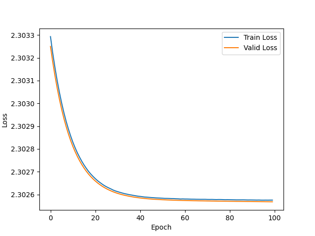

# 视听信息系统导论第一次编程作业报告

## 1 实验内容

### 1.1 构建结构如下的神经网络，在层与层之间使用 tanh 激活函数，不使用 BatchNorm，使用 SGD 优化器，完成 CIFAR10 图像分类任务，绘制出训练、测试时的损失曲线，并绘制准确率变化图像。

实验中使用 tanh 激活函数，不使用 BatchNorm ，完成测试任务后得到的曲线如下：

| Loss 曲线              | Accuracy 曲线         |
| ---------------------- | --------------------- |
|  |  |

### 1.2 仍然使用上述网络结构，将激活函数更改为 ReLU 函数，并使用 BatchNorm，使用 SGD 优化器，完成 CIFAR10 图像分类任务，绘制出训练、测试时的损失曲线，并绘制准确率变化图像。

实验中激活函数使用 ReLU ，并且使用 BatchNorm ，完成测试任务后得到的曲线如下：

| Loss 曲线              | Accuracy 曲线         |
| ---------------------- | --------------------- |
|  |  |

### 1.3 在 1.2 的基础上，将优化器换为 Adam 优化器，完成 CIFAR10 图像分类任务，绘制出训 练、测试时的损失曲线，并绘制准确率变化图像。

在 [1.2](#12-仍然使用上述网络结构将激活函数更改为-relu-函数并使用-batchnorm使用-sgd-优化器完成-cifar10-图像分类任务绘制出训练测试时的损失曲线并绘制准确率-变化图像) 的基础上，使用 Adam 优化器，完成测试任务后得到的曲线如下：

| Loss 曲线              | Accuracy 曲线         |
| ---------------------- | --------------------- |
|  |  |

### 1.4 构建规定的神经网络，重复 1.1 到 1.3 的任务。

构建指导书中的神经网络，重复任务 1.1 到 1.3 得到的图像如下：

| Loss 曲线              | Accuracy 曲线         |
| ---------------------- | --------------------- |
|  |  |
|  |  |
|  |  |

## 2 结果分析

### 2.1 请根据结果分析 ReLU 和 tanh 激活函数的表现

由于题目要求没有控制变量（1.2 中将激活函数更改为 ReLU 函数的同时使用了 BatchNorm），变量改变不唯一。因此我们另外测试了只将激活函数更改为 ReLU 函数的情况，以及在使用 BatchNorm 时将 tanh 作为激活函数函数的情况，此时变量是唯一的，更有助于我们研究不同激活函数造成的影响。通过实验得到的测试结果如下表：

<table>
    <tr>
        <th>BatchNorm 函数</th>
        <th>模型</th>
        <th>使用 tanh 函数激活</th>
        <th>使用 ReLU 函数激活</th>
    </tr>
    <tr>
        <td rowspan="2">不使用</td>
        <td>1</td>
        <td></td>
        <td></td>
    </tr>
    <tr>
        <td>2</td>
        <td></td>
        <td></td>
    </tr>
    <tr>
        <td rowspan="2">使用</td>
        <td>1</td>
        <td></td>
        <td></td>
    </tr>
    <tr>
        <td>2</td>
        <td></td>
        <td></td>
    </tr>
</table>

<table>
    <tr>
        <th>BatchNorm 函数</th>
        <th>模型</th>
        <th>使用 tanh 函数激活</th>
        <th>使用 ReLU 函数激活</th>
    </tr>
    <tr>
        <td rowspan="2">不使用</td>
        <td>1</td>
        <td></td>
        <td></td>
    </tr>
    <tr>
        <td>2</td>
        <td></td>
        <td></td>
    </tr>
    <tr>
        <td rowspan="2">使用</td>
        <td>1</td>
        <td></td>
        <td></td>
    </tr>
    <tr>
        <td>2</td>
        <td></td>
        <td></td>
    </tr>
</table>

横向对比可以看到在其他条件均相同的情况下，不同激活函数对实验产生的影响。如果从简单的单变量的角度进行分析的话，在不使用 BatchNorm 的情况下，单独换用 ReLU 和 tanh激活函数，模型 1 差异不大，模型 2 中 ReLU 函数会让 Loss 的减小更加迅速。而在加上 BatchNorm 后，ReLU 激活函数的模型在训练集和测试集上的表现略微更好一些，但是数值上的差异不大。

但是如果考虑到激活函数的特点不同（BatchNorm 可以做归一化为零均值和单位方差，tanh 激活函数输出的值本身就是归一化的）。当 ReLU 激活函数同时使用 BatchNorm 时，可以看到 ReLU 激活函数在各方面的表现都要优于 tanh 函数，ReLU 函数相较于 tanh 函数来说，Loss 曲线下降速度更快，更快到达稳定，稳定时 Loss 的值会更小。而且使用 ReLU 做激活函数，正确率也会更高，趋于稳定的速度更快，同时可以明显看到在模型深度比较深的情况下，tanh 函数激活准确率会出现明显的下降现象，而使用 ReLU 做激活函数则没有这种现象。

主要的原因可能是因为：

1.  ReLU 的优点在于其计算简单、在正区间保持线性，有助于解决梯度消失问题，并且在稀疏激活时表现良好。缺点是在负区间值恒定为 0，可能出现“死神经元”，永远输出 0。
2.  tanh的优点在于输出范围更为平衡（-1 到 1），有助于中心化数据，但在深层网络中可能导致梯度消失，影响学习速度。

## 2.2 请根据结果分析 BatchNorm 的作用

和讨论 1 中相似，我们同样使用控制变量法将变量控制为单一的是否使用BatchNorm，从而得到的训练结果如下：

<table>
    <tr>
        <th>模型</th>
        <th>不使用 BatchNorm 函数</th>
        <th>使用 BatchNorm 函数</th>
    </tr>
    <tr>
        <td>1</td>
        <td></td>
        <td></td>
    </tr>
    <tr>
        <td>2</td>
        <td></td>
        <td></td>
    </tr>
</table>

<table>
    <tr>
        <th>模型</th>
        <th>不使用 BatchNorm 函数</th>
        <th>使用 BatchNorm 函数</th>
    </tr>
    <tr>
        <td>1</td>
        <td></td>
        <td></td>
    </tr>
    <tr>
        <td>2</td>
        <td></td>
        <td></td>
    </tr>
</table>

对比使用 BatchNorm 和不使用 BatchNorm 的实验结果，可以看到在第 1 个较小的模型中，在使用 ReLU 函数的情况下，加入 BatchNorm 后，模型的准确率上升速度快速提升，且在训练集和测试集上的表现差距变小。而在第 2 个较深的模型中，不使用 BatchNorm 时，模型在 100 个 epoch 内几乎没有学习到任何东西，而使用 BatchNorm 后，模型在 100 个 epoch 内的准确率上升速度明显提升，训练效果提升显著。这说明 BatchNorm 能够在较少的 epoch 内使模型趋向于收敛，且能够减小过拟合的风险。

同时根据激活函数的特点不同，对 BatchNorm 的依赖程度不同，可以知道 BatchNorm 可以将测试数据进行归一化，从而起到加速训练、减小 ReLU 激活函数梯度消失问题、提高模型稳定性等作用。

### 2.3 请根据结果分析更换优化器的效果

使用不同优化器得到的训练结果如下：

| 模型 | 使用 SGD 优化器        | 使用 Adam 优化器       |
| ---- | ---------------------- | ---------------------- |
| 1    |  |  |
| 2    |  |  |

| 模型 | 使用 SGD 优化器        | 使用 Adam 优化器       |
| ---- | ---------------------- | ---------------------- |
| 1    |   |   |
| 2    |   |   |

对比使用 SGD 和使用 Adam 的实验结果，可以看到将优化器从 SGD 更换为 Adam 后，模型的准确率能够在较少的 epoch 内达到较高的水平，曲线也更加平滑。在 100 个 epoch 内，Adam 优化器的模型准 确率明显高于 SGD 优化器的模型准确率。但是可以发现，到后期 Adam 的验证集 Loss 曲线显著高于训练集 Loss 曲线，难以下降，这可能是由于过拟合导致的。

这是因为 Adam 的自适应性学习率能够使模型在训练过程中更快地收敛，且能够避免 SGD 的学习率过大导致的梯度震荡现象。Adam 倾向于更快地收敛，但也可能更容易陷入过拟合。在训练后期，它可能会过快地找到局部最优解，导致模型的泛化能力下降。

### 2.4 请根据你的结果分析模型是否出现了过拟合，如有，请在图像中指出在哪里出现了 过拟合。如无，请给出你判断的原因

实验 4 过程中确实出现了过拟合，如下图


实验 1 到 3 几乎都没有出现过拟合的情况。实验 4 中使用 SGD 优化时过拟合现象也不明显。但是在实验 4 将优化器切换为 Adam 优化器后，模型出现了明显的过拟合。验证集的 Loss 几乎保持不变，而训练集的 Loss在后期持续下降，这说明模型在训练集上表现良好，但在验证集上表现较差，即模型出现了过拟合。

> 注：这是错误的。实验中没有出现过拟合。

## 附录：代码填空

### DeepNet

```python
class DeepNet(nn.Module):
    def __init__(self, act):
        super(DeepNet, self).__init__()
        ################### 代码填空：请在此填补模型定义代码 ###################
        self.conv1 = nn.Conv2d(3, 16, 3, padding=1)
        self.conv2 = nn.Conv2d(16, 32, 3, padding=1)
        self.pool1 = nn.MaxPool2d(2, 2)
        self.conv3 = nn.Conv2d(32, 64, 3, padding=1)
        self.conv4 = nn.Conv2d(64, 128, 3, padding=1)
        self.pool2 = nn.MaxPool2d(2, 2)
        self.conv5 = nn.Conv2d(128, 256, 3, padding=1)
        self.conv6 = nn.Conv2d(256, 512, 1, padding=0)
        self.pool3 = nn.AdaptiveAvgPool2d((1, 1))
        self.fc1 = nn.Linear(512, 256)
        self.fc2 = nn.Linear(256, 128)
        self.fc3 = nn.Linear(128, 10)
        if act == 'relu':
            self.act = F.relu
        elif act == 'tanh':
            self.act = F.tanh
        elif act == 'sigmoid':
            self.act = F.sigmoid
        ##################################################################

    def forward(self, x):
        # convolutional layers
        ################### 代码填空：请在此填补前向计算代码 ###################
        x = self.pool1(self.act(self.conv2(self.act(self.conv1(x)))))
        x = self.pool2(self.act(self.conv4(self.act(self.conv3(x)))))
        x = self.pool3(self.act(self.conv6(self.act(self.conv5(x)))))
        x = x.view(-1, 512)
        x = self.act(self.fc1(x))
        x = self.act(self.fc2(x))
        x = self.fc3(x)
        return x
        ##################################################################
        pass
```

### BnDeepNet

```python
class BnDeepNet(nn.Module):
    def __init__(self,act):
        super(BnDeepNet, self).__init__()
        ################### 代码填空：请在此填补模型定义代码 ###################
        self.conv1 = nn.Conv2d(3, 16, 3, padding=1)
        self.bn1 = nn.BatchNorm2d(16)
        self.conv2 = nn.Conv2d(16, 32, 3, padding=1)
        self.bn2 = nn.BatchNorm2d(32)
        self.pool1 = nn.MaxPool2d(2, 2)
        self.conv3 = nn.Conv2d(32, 64, 3, padding=1)
        self.bn3 = nn.BatchNorm2d(64)
        self.conv4 = nn.Conv2d(64, 128, 3, padding=1)
        self.bn4 = nn.BatchNorm2d(128)
        self.pool2 = nn.MaxPool2d(2, 2)
        self.conv5 = nn.Conv2d(128, 256, 3, padding=1)
        self.bn5 = nn.BatchNorm2d(256)
        self.conv6 = nn.Conv2d(256, 512, 1, padding=0)
        self.bn6 = nn.BatchNorm2d(512)
        self.pool3 = nn.AdaptiveAvgPool2d((1, 1))
        self.fc1 = nn.Linear(512, 256)
        self.bn7 = nn.BatchNorm1d(256)
        self.fc2 = nn.Linear(256, 128)
        self.bn8 = nn.BatchNorm1d(128)
        self.fc3 = nn.Linear(128, 10)
        if act == 'relu':
            self.act = F.relu
        elif act == 'tanh':
            self.act = F.tanh
        elif act == 'sigmoid':
            self.act = F.sigmoid
        ###################################################################

    def forward(self, x):
        # convolutional layers
        ################### 代码填空：请在此填补前向计算代码 ###################
        x = self.pool1(self.act(self.bn2(self.conv2(self.act(self.bn1(self.conv1(x)))))))
        x = self.pool2(self.act(self.bn4(self.conv4(self.act(self.bn3(self.conv3(x)))))))
        x = self.pool3(self.act(self.bn6(self.conv6(self.act(self.bn5(self.conv5(x)))))))
        x = x.view(-1, 512)
        x = self.act(self.bn7(self.fc1(x)))
        x = self.act(self.bn8(self.fc2(x)))
        x = self.fc3(x)
        return x
        ##################################################################
        pass
```

### Optimizer

```python
optimizer_type = "SGD" #或者换成AdamW
    if optimizer_type == "SGD":
    optimizer = optim.SGD(model.parameters(), lr=0.001)
elif optimizer_type == "Adam":
    ########## 代码填空：请在此填补Adam优化器计算代码, lr=0.0001 ###########
    optimizer = optim.Adam(model.parameters(), lr=0.0001)
    ##################################################################
    pass
```
