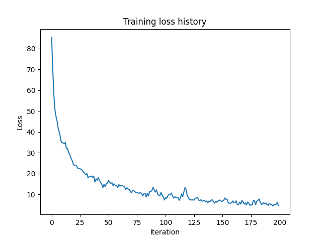
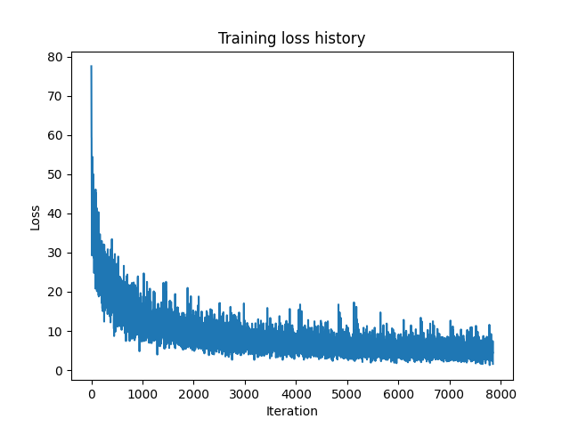

# 视听信息系统导论第二次编程作业报告

## 1 实验任务

### 1.1 Task1

**完成 `model.py` 文件中 `__init__` 函数。（完成代码即可，不用在报告中写文字说明）**

代码如下：

```python
def __init__(self, in_dim=1280, hidden_dim=256, num_classes=20, \
            roi_output_w=2, roi_output_h=2, drop_ratio=0.3):
    super().__init__()

    assert(num_classes != 0)
    self.num_classes = num_classes
    self.roi_output_w, self.roi_output_h = roi_output_w, roi_output_h
    self.feat_extractor = FeatureExtractor()
    ##############################################################################
    # TODO: Declare the cls & bbox heads (in Fast R-CNN).                        #
    # The cls & bbox heads share a sequential module with a Linear layer,        #
    # followed by a Dropout (p=drop_ratio), a ReLU nonlinearity and another      #
    # Linear layer.                                                              #
    # The cls head is a Linear layer that predicts num_classes + 1 (background). #
    # The det head is a Linear layer that predicts offsets(dim=4).               #
    # HINT: The dimension of the two Linear layers are in_dim -> hidden_dim and  #
    # hidden_dim -> hidden_dim.                                                  #
    ##############################################################################
    # Replace "pass" statement with your code
    self.shared_fc = nn.Sequential(
        nn.Linear(in_dim, hidden_dim),
        nn.Dropout(drop_ratio),
        nn.ReLU(),
        nn.Linear(hidden_dim, hidden_dim)
    )
    self.cls_head = nn.Linear(hidden_dim, num_classes + 1)
    self.bbox_head = nn.Linear(hidden_dim, 4)
    ##############################################################################
    #                               END OF YOUR CODE                             #
    ##############################################################################
```

### 1.2 Task2

**完成 `utils.py` 文件中的 compute_iou 函数。（完成代码即可，不用在报告中写文字说明）**

代码如下：

```python
def compute_iou(anchors, bboxes):
    """
    Compute the intersection-over-union between anchors and gts.
    
    Inputs:
    - anchors: Anchor boxes, of shape (M, 4), where M is the number of proposals
    - bboxes: GT boxes of shape (N, 4), where N is the number of GT boxes,
                4 indicates (x_{lr}^{gt}, y_{lr}^{gt}, x_{rb}^{gt}, y_{rb}^{gt})
    
    Outputs:
    - iou: IoU matrix of shape (M, N)
    """
    iou = None
    ##############################################################################
    # TODO: Given anchors and gt bboxes,                                         #
    # compute the iou between each anchor and gt bbox.                           #
    ##############################################################################
    x1 = torch.max(anchors[:, None, 0], bboxes[None, :, 0])
    y1 = torch.max(anchors[:, None, 1], bboxes[None, :, 1])
    x2 = torch.min(anchors[:, None, 2], bboxes[None, :, 2])
    y2 = torch.min(anchors[:, None, 3], bboxes[None, :, 3])
    inter = torch.clamp(x2 - x1, min=0) * torch.clamp(y2 - y1, min=0)
    area_anchors = (anchors[:, 2] - anchors[:, 0]) * (anchors[:, 3] - anchors[:, 1])
    area_bboxes = (bboxes[:, 2] - bboxes[:, 0]) * (bboxes[:, 3] - bboxes[:, 1])
    union = area_anchors[:, None] + area_bboxes[None, :] - inter
    iou = torch.zeros_like(union)
    non_zero_union = union > 0
    iou[non_zero_union] = inter[non_zero_union] / union[non_zero_union]
    ##############################################################################
    #                               END OF YOUR CODE                             #
    ##############################################################################

    return iou
```

### 1.3 Task3

**阅读 `utils.py` 文件中的 `assign_label` 函数，并简要说明该函数如何判断正负样本框。**

答：`assign_label` 函数用于在模型训练中将候选框（proposals）分配为正样本或负样本。如果某个候选框与任意一个 GT 框的 IoU 值是所有候选框中的最大值，或者当候选框与某个 GT 框的 IoU 大于正样本阈值（`pos_thresh`）时，则该候选框被标记为正样本。当候选框与所有 GT 框的 IoU 值都小于负样本阈值（`neg_thresh`）时，该候选框被标记为负样本，此外再随机采样负样本以平衡正负比例。

**阅读 `utils.py` 文件中的 `compute_offsets` 函数，简要说明如何计算正样本框到真实框的偏移量。**

答：`compute_offsets` 函数用于计算正样本框（anchors）相对于真实框（GT boxes）的偏移量，以便在模型训练中进行位置调整。

计算 GT 框和 anchor 框的宽高比例，通过 `torch.log` 函数取对数来得到宽高偏移量：

$$
\Delta w = \log\left(\frac{w^{\text{gt}}}{w^{\text{anchor}}}\right), \quad \Delta h = \log\left(\frac{h^{\text{gt}}}{h^{\text{anchor}}}\right)
$$

计算 GT 框与 anchor 框的中心坐标差异，并对 anchor 框的宽高进行归一化来得到中心坐标偏移量：

$$
\Delta x = \frac{x_{\text{center}}^{\text{gt}} - x_{\text{center}}^{\text{anchor}}}{w^{\text{anchor}}}, \quad \Delta y = \frac{y_{\text{center}}^{\text{gt}} - y_{\text{center}}^{\text{anchor}}}{h^{\text{anchor}}}
$$

随后将这四个偏移量拼接在一起，得到最终的偏移量。

$$
\text{offsets} = (\Delta x, \Delta y, \Delta w, \Delta h)
$$

### 1.4 Task4

**完成 `model.py` 文件中的 `forward` 函数。（完成代码即可，不用在报告中写文字说明）**

代码如下：

```python
def forward(self, images, bboxes, bbox_batch_ids, proposals, proposal_batch_ids):
    """
    Training-time forward pass for our two-stage Faster R-CNN detector.

    Inputs:
    - images: Tensor of shape (B, 3, H, W) giving input images
    - bboxes: Tensor of shape (N, 5) giving ground-truth bounding boxes
    and category labels, from the dataloader, where N is the total number
    of GT boxes in the batch
    - bbox_batch_ids: Tensor of shape (N, ) giving the index (in the batch)
    of the image that each GT box belongs to
    - proposals: Tensor of shape (M, 4) giving the proposals for input images, 
    where M is the total number of proposals in the batch
    - proposal_batch_ids: Tensor of shape (M, ) giving the index of the image 
    that each proposals belongs to

    Outputs:
    - total_loss: Torch scalar giving the overall training loss.
    """
    w_cls = 1 # for cls_scores
    w_bbox = 1 # for offsets
    total_loss = None
    ##############################################################################
    # TODO: Implement the forward pass of Fast R-CNN.                            #
    # A few key steps are outlined as follows:                                   #
    # i) Extract image fearure.                                                  #
    # ii) Perform RoI Align on proposals, then meanpool the feature in the       #
    #     spatial dimension.                                                     #
    # iii) Pass the RoI feature through the shared-fc layer. Predict             #
    #      classification scores ans box offsets.                                #
    # iv) Assign the proposals with targets of each image.                       # 
    # v) Compute the cls_loss between the predicted class_prob and GT_class      #
    #    (For poistive & negative proposals)                                     #
    #    Compute the bbox_loss between the offsets and GT_offsets                #
    #    (For positive proposals)                                                #
    #    Compute the total_loss which is formulated as:                          #
    #    total_loss = w_cls*cls_loss + w_bbox*bbox_loss.                         #
    ##############################################################################
    # Replace "pass" statement with your code
    B, _, H, W = images.shape
    
    # extract image feature
    features = self.feat_extractor(images)

    # perform RoI Pool & mean pool
    boxes = torch.cat((proposal_batch_ids.unsqueeze(1), proposals), dim=-1)
    roi_feat = torchvision.ops.roi_pool(features, boxes, (self.roi_output_w, self.roi_output_h))
    roi_feat = roi_feat.mean(dim=[2, 3])

    # forward heads, get predicted cls scores & offsets
    shared_feat = self.shared_fc(roi_feat)
    cls_scores = self.cls_head(shared_feat)
    bbox_offsets = self.bbox_head(shared_feat)

    # assign targets with proposals
    pos_masks, neg_masks, GT_labels, GT_bboxes = [], [], [], []
    for img_idx in range(B):
        # get the positive/negative proposals and corresponding
        # GT box & class label of this image
        proposals_img = proposals[proposal_batch_ids == img_idx]
        bboxes_img = bboxes[bbox_batch_ids == img_idx]
        pos_mask, neg_mask, GT_label, GT_bbox = assign_label(proposals_img, bboxes_img, self.num_classes)
        pos_masks.append(pos_mask)
        neg_masks.append(neg_mask)
        GT_labels.append(GT_label)
        GT_bboxes.append(GT_bbox)

    # compute loss
    cls_loss = 0
    bbox_loss = 0
    for img_idx in range(B):
        pos_mask = pos_masks[img_idx]
        neg_mask = neg_masks[img_idx]
        GT_label = GT_labels[img_idx]
        GT_bbox = GT_bboxes[img_idx]
        proposals_img = proposals[proposal_batch_ids == img_idx]
        cls_scores_img = cls_scores[proposal_batch_ids == img_idx]
        bbox_offsets_img = bbox_offsets[proposal_batch_ids == img_idx]
        cls_loss += ClsScoreRegression(cls_scores_img[pos_mask | neg_mask], GT_label[pos_mask | neg_mask], B)
        bbox_loss += BboxRegression(bbox_offsets_img[pos_mask], compute_offsets(proposals_img[pos_mask], GT_bbox), B)
    total_loss = w_cls * cls_loss + w_bbox * bbox_loss
    ##############################################################################
    #                               END OF YOUR CODE                             #
    ##############################################################################
    return total_loss
```

### 1.5 Task5

**完成 `utils.py` 的 `generate_proposal` 函数。（完成代码即可，不用在报告中写文字说明）**

代码如下：

```python
def generate_proposal(anchors, offsets):
    """
    Proposal generator.

    Inputs:
    - anchors: Anchor boxes, of shape (M, 4). Anchors are represented
    by the coordinates of their top-left and bottom-right corners.
    - offsets: Transformations of shape (M, 4) that will be used to
    convert anchor boxes into region proposals. The transformation
    offsets[m] = (tx, ty, tw, th) will be applied to the anchor
    anchors[m].

    Outputs:
    - proposals: Region proposals of shape (M, 4), represented by the
    coordinates of their top-left and bottom-right corners. Applying the
    transform offsets[m] to the anchor[m] should give the
    proposal proposals[m].

    """
    proposals = None
    ##############################################################################
    # TODO: Given anchor coordinates and the proposed offset for each anchor,    #
    # compute the proposal coordinates using the transformation formulas above.  #
    ##############################################################################
    # Replace "pass" statement with your code
    xy_offsets = offsets[:, :2]
    wh_offsets = offsets[:, 2:4]
    proposals_minus = torch.exp(wh_offsets) * (anchors[:, 2:4] - anchors[:, :2])
    proposals_plus = xy_offsets * (anchors[:, 2:4] - anchors[:, :2]) * 2 + (anchors[:, :2] + anchors[:, 2:4])
    proposals = torch.cat(((proposals_plus - proposals_minus) / 2, (proposals_plus + proposals_minus) / 2), dim=-1)
    ##############################################################################
    #                               END OF YOUR CODE                             #
    ##############################################################################

    return proposals
```

### 1.6 Task6

完成 `model.py` 的 `inference` 函数。（完成代码即可，不用在报告中写文字说明）

代码如下：

```python
def inference(self, images, proposals, proposal_batch_ids, thresh=0.5, nms_thresh=0.7):
    """"
    Inference-time forward pass for our two-stage Faster R-CNN detector

    Inputs:
    - images: Tensor of shape (B, 3, H, W) giving input images
    - proposals: Tensor of shape (M, 4) giving the proposals for input images, 
    where M is the total number of proposals in the batch
    - proposal_batch_ids: Tensor of shape (M, ) giving the index of the image 
    that each proposals belongs to
    - thresh: Threshold value on confidence probability. HINT: You can convert the
    classification score to probability using a softmax nonlinearity.
    - nms_thresh: IoU threshold for NMS

    We can output a variable number of predicted boxes per input image.
    In particular we assume that the input images[i] gives rise to P_i final
    predicted boxes.

    Outputs:
    - final_proposals: List of length (B,) where final_proposals[i] is a Tensor
    of shape (P_i, 4) giving the coordinates of the final predicted boxes for
    the input images[i]
    - final_conf_probs: List of length (B,) where final_conf_probs[i] is a
    Tensor of shape (P_i, 1) giving the predicted probabilites that the boxes
    in final_proposals[i] are objects (vs background)
    - final_class: List of length (B,), where final_class[i] is an int64 Tensor
    of shape (P_i, 1) giving the predicted category labels for each box in
    final_proposals[i].
    """
    final_proposals, final_conf_probs, final_class = None, None, None
    ##############################################################################
    # TODO: Predicting the final proposal coordinates `final_proposals`,         #
    # confidence scores `final_conf_probs`, and the class index `final_class`.   #
    # The overall steps are similar to the forward pass, but now you cannot      #
    # decide the activated nor negative proposals without GT boxes.              #
    # You should apply post-processing (thresholding and NMS) to all proposals   #
    # and keep the final proposals.                                               #
    ##############################################################################
    # Replace "pass" statement with your code
    B = images.shape[0]

    # extract image feature
    features = self.feat_extractor(images)

    # perform RoI Pool & mean pool
    boxes = torch.cat((proposal_batch_ids.unsqueeze(1), proposals), dim=-1)
    roi_feat = torchvision.ops.roi_pool(features, boxes, (self.roi_output_w, self.roi_output_h))
    roi_feat = roi_feat.mean(dim=[2, 3])

    # forward heads, get predicted cls scores & offsets
    shared_feat = self.shared_fc(roi_feat)
    cls_scores = self.cls_head(shared_feat)
    bbox_offsets = self.bbox_head(shared_feat)

    # get predicted boxes & class label & confidence probability
    conf_probs = torch.softmax(cls_scores, dim=-1)
    pred_boxes = generate_proposal(proposals, bbox_offsets)

    final_proposals = []
    final_conf_probs = []
    final_class = []
    # post-process to get final predictions
    for img_idx in range(B):

        # filter by threshold
        img_proposals = pred_boxes[proposal_batch_ids == img_idx]
        img_conf_probs = conf_probs[proposal_batch_ids == img_idx]
        img_cls_scores = cls_scores[proposal_batch_ids == img_idx]
        keep = img_conf_probs[:, :self.num_classes].max(dim=1).values > thresh
        img_proposals = img_proposals[keep]
        img_conf_probs = img_conf_probs[keep]
        img_cls_scores = img_cls_scores[keep]
        conf_values, pred_classes = img_conf_probs[:, :self.num_classes].max(dim=1)

        # nms
        keep_idx = torchvision.ops.nms(img_proposals, conf_values, nms_thresh)
        final_proposals.append(img_proposals[keep_idx])
        final_conf_probs.append(conf_values[keep_idx].unsqueeze(1))
        final_class.append(pred_classes[keep_idx].unsqueeze(1))

    ##############################################################################
    #                               END OF YOUR CODE                             #
    ##############################################################################
    return final_proposals, final_conf_probs, final_class
```

### 1.7 Task7

**完成过拟合实验，在报告中给出训练损失曲线和测试样本可视化。**

训练损失函数曲线和测试样本可视化如下：



<table>
  <tr>
    <td></td>
    <td></td>
    <td></td>
  <tr>
    <td></td>
    <td></td>
    <td></td>
  </tr>
  <tr>
    <td></td>
    <td></td>
    <td></td>
  </tr>
  <tr>
    <td></td>
  </tr>
</table>

注意到，训练损失函数曲线和 “car” 的测试样本与说明文档中的示例几乎完全一致，说明实验结果符合预期。

### 1.8 Task8

**完成最终实验，在报告中给出训练损失曲线和评测情况。**

训练损失函数曲线和评测情况如下：



<table>
  <tr>
    <td></td>
    <td></td>
  </tr>
  <tr>
    <td></td>
    <td></td>
  </tr>
</table>

<table>
  <tr>
    <td></td>
    <td></td>
    <td></td>
    <td></td>
  </tr>
  <tr>
    <td></td>
    <td></td>
    <td></td>
    <td></td>
  </tr>
  <tr>
    <td></td>
    <td></td>
    <td></td>
    <td></td>
  </tr>
  <tr>
    <td></td>
    <td></td>
    <td></td>
    <td></td>
  </tr>
  <tr>
    <td></td>
    <td></td>
    <td></td>
    <td></td>
  </tr>
</table>

受限于算力和时间，最终评测得到的 mAP 为 18.68%，与说明文档中的预期（18% 左右）相符。