# 视听信息系统导论第三次编程作业报告

## 1 实验任务

### 1.1 数据准备

#### 1.1.1 TASK 1

补全 `dataset.py` 中的 `prepare_data` 函数，并详细说明整个函数是如何构建词表的。

函数代码如下：

```python
def prepare_data(data_path):
    with open(data_path) as f:
        data = f.read()

    ################################################################################
    # TODO: insert '#' at the end of each paragraph, delete all special chars;     #
    #  you can leverage data.replace() and data.split() to accomplish that.        #
    #  two or three lines of code should be sufficient.                            #
    ################################################################################
    # *****START OF YOUR CODE (DO NOT DELETE/MODIFY THIS LINE)*****

    data = data.replace('\n\n', '#')
    data = '` `'.join(data.split())
    
    # *****END OF YOUR CODE (DO NOT DELETE/MODIFY THIS LINE)*****
    ################################################################################
    #                              END OF YOUR CODE                                #
    ################################################################################
```

其中词表的构建流程是：

首先对数据进行预处理。

再提取唯一字符集合：`unique_chars = set(data)`。

将每个字符映射为一个唯一索引：`voc2ind[char] = idx`。
再创建反向映射：`ind2voc = {val: key for key, val in voc2ind.items()}`。

将 `data` 按 80% 和 20% 分割成训练集和测试集，使用 `voc2ind[char]` 将训练集和测试集中的每个字符转换为对应的整数索引。

将训练集和测试集的整数表示、字符到索引的正向映射、字符到索引的反向映射保存下来。

#### 1.1.2 TASK 2

请完成 `dataset.py` 中的 `HarryPotterDataset` 类。（完成代码即可，不用在报告中写文字说明）

代码如下：

```python
class HarryPotterDataset(torch.utils.data.Dataset):
    def __init__(self, data_file, sequence_length, batch_size):
        super(HarryPotterDataset, self).__init__() 

        self.sequence_length = sequence_length
        self.batch_size = batch_size
        self.vocab = Vocabulary(data_file)

        with open(data_file, 'rb') as data_pkl:
            dataset = pickle.load(data_pkl)
        
        self.tokens = dataset['tokens']
        self.voc2ind = dataset['voc2ind']
        self.ind2voc = dataset['ind2voc']

        self.data = None
        self.sequences_in_batch = None
        ################################################################################
        # TODO: split self.tokens to len(self.tokens)//batch_size chunks, store the    #
        #  reshaped data (and convert it to torch.LongTensor) in self.data;            #
        #  Then compute how many sequences are there in each chunk, store that in      #
        #  self.sequences_in_batch                                                     #
        ################################################################################
        # *****START OF YOUR CODE (DO NOT DELETE/MODIFY THIS LINE)*****

        self.data = torch.LongTensor(self.tokens[:len(self.tokens) // self.batch_size * self.batch_size])
        self.data = self.data.view(self.batch_size, -1)
        self.sequences_in_batch = self.data.size(1) // self.sequence_length

        # *****END OF YOUR CODE (DO NOT DELETE/MODIFY THIS LINE)*****
        ################################################################################
        #                              END OF YOUR CODE                                #
        ################################################################################

    def __len__(self):
        ################################################################################
        # TODO: return the total number of sequences in dataset                        #
        ################################################################################
        # *****START OF YOUR CODE (DO NOT DELETE/MODIFY THIS LINE)*****
        
        return self.sequences_in_batch * self.batch_size

        # *****END OF YOUR CODE (DO NOT DELETE/MODIFY THIS LINE)*****
        ################################################################################
        #                              END OF YOUR CODE                                #
        ################################################################################
        
    def __getitem__(self, idx):
        data = None
        ################################################################################
        # TODO: Based on idx, determine the chunk idx and the sequence idx of the chunk#
        #  fetch that sequence data from self.data and store that in data variable;    #
        #  Note the data length should be sequence_length + 1                          #
        ################################################################################
        # *****START OF YOUR CODE (DO NOT DELETE/MODIFY THIS LINE)*****

        chunk_idx = idx // self.sequences_in_batch
        seq_idx = idx % self.sequences_in_batch
        start = seq_idx * self.sequence_length
        end = start + self.sequence_length + 1
        data = self.data[chunk_idx, start:end]

        # *****END OF YOUR CODE (DO NOT DELETE/MODIFY THIS LINE)*****
        ################################################################################
        #                              END OF YOUR CODE                                #
        ################################################################################

        # returns input data and label data (next token of input) with their length sequence_length
        return data[:-1], data[1:]

    def vocab_size(self):
        return len(self.vocab)
```

### 1.2 构建模型

#### 1.2.1 TASK 3

请完成 `model.py` 中的 `HarryPotterTransformer` 类。（完成代码即可，不用在报告中写文字说明）请基于构建的网络完成训练，绘制训练、测试的损失曲线和测试的准确率曲线。（请绘制在报告中）

代码如下：

```python
class HarryPotterTransformer(nn.Module):
    def __init__(self, vocab_size, feature_size, num_heads):
        super(HarryPotterTransformer, self).__init__()
        self.vocab_size = vocab_size
        self.feature_size = feature_size
        self.num_heads = num_heads
        self.best_accuracy = -1

        self.embedding = None
        self.transformer_encoder = None
        self.decoder = None
        self.pos_encoding = None # you can omit this for Task 4

        ################################################################################
        # TODO: define the network                                                     #
        ################################################################################
        # *****START OF YOUR CODE (DO NOT DELETE/MODIFY THIS LINE)*****

        self.embedding = nn.Embedding(vocab_size, feature_size)
        encoder_layer = nn.TransformerEncoderLayer(
            d_model=feature_size,
            nhead=num_heads,
            dim_feedforward=4 * feature_size,
            dropout=0.1
        )
        self.transformer_encoder = nn.TransformerEncoder(encoder_layer, num_layers=2)
        self.decoder = nn.Linear(feature_size, vocab_size)
        self.pos_encoding = PositionalEncoding(feature_size)

        # *****END OF YOUR CODE (DO NOT DELETE/MODIFY THIS LINE)*****
        ################################################################################
        #                              END OF YOUR CODE                                #
        ################################################################################

    def forward(self, x):        
        attn_mask = None # you can omit this for Task 4 and Task 5
        ################################################################################
        # TODO: finish the forward pass                                                #
        ################################################################################
        # *****START OF YOUR CODE (DO NOT DELETE/MODIFY THIS LINE)*****

        x = self.embedding(x) # [batch_size, seq_len, feature_size]
        x = x.permute(1, 0, 2) # [seq_len, batch_size, feature_size]
        x = self.transformer_encoder(x, mask=attn_mask) # [seq_len, batch_size, feature_size]
        x = x.permute(1, 0, 2) # [batch_size, seq_len, feature_size]
        x = self.decoder(x) # [batch_size, seq_len, vocab_size]

        # *****END OF YOUR CODE (DO NOT DELETE/MODIFY THIS LINE)*****
        ################################################################################
        #                              END OF YOUR CODE                                #
        ################################################################################

        return x
```

得到的模型训练、测试的损失曲线和测试的准确率曲线如下：

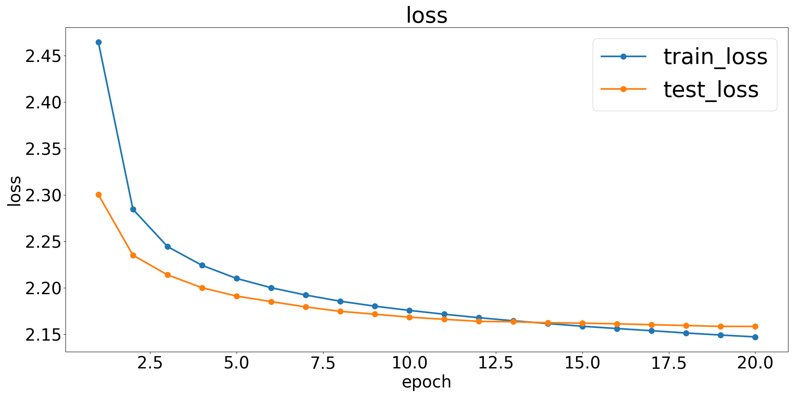

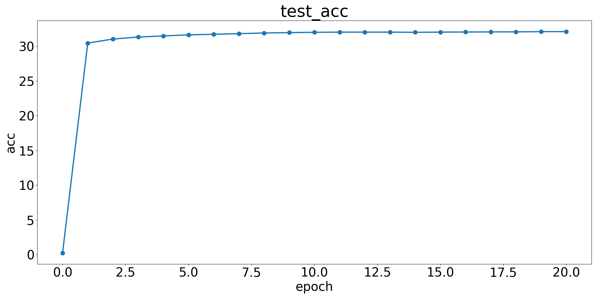

#### 1.2.2 TASK 4

请完成 `model.py` 中的 `PositionalEncoding` 类并将其加入到 `HarryPotterTransformer` 类中。（完成代码即可，不用在报告中写文字说明）请基于构建的网络完成训练，绘制训练、测试的损失曲线和测试的准确率曲线，并且分析 positional encoding 的作用。（请绘制在报告中）

代码如下：

```python
class PositionalEncoding(nn.Module):
    def __init__(self, d_model, max_len = 5000):
        super().__init__()
        pe = None
        ################################################################################
        # TODO: compute the positional encoding                                        #
        ################################################################################
        # *****START OF YOUR CODE (DO NOT DELETE/MODIFY THIS LINE)*****

        pe = torch.zeros(max_len, d_model)
        position = torch.arange(0, max_len).unsqueeze(1)
        div_term = torch.exp(torch.arange(0, d_model, 2) * (-math.log(10000.0) / d_model))
        pe[:, 0::2] = torch.sin(position * div_term)
        pe[:, 1::2] = torch.cos(position * div_term)

        # *****END OF YOUR CODE (DO NOT DELETE/MODIFY THIS LINE)*****
        ################################################################################
        #                              END OF YOUR CODE                                #
        ################################################################################
        self.register_buffer('pe', pe)

    def forward(self, x):
        """
        Arguments:
            x: Tensor, shape ``[batch_size, seq_len, embedding_dim]``
        """
        x = x + self.pe.unsqueeze(0)[:, :x.size(1)]
        return x

class HarryPotterTransformer(nn.Module):
    def forward(self, x):        
        attn_mask = None # you can omit this for Task 4 and Task 5
        ################################################################################
        # TODO: finish the forward pass                                                #
        ################################################################################
        # *****START OF YOUR CODE (DO NOT DELETE/MODIFY THIS LINE)*****

        x = self.embedding(x) # [batch_size, seq_len, feature_size]
        x = self.pos_encoding(x) # [batch_size, seq_len, feature_size], Added in Task 4
        x = x.permute(1, 0, 2) # [seq_len, batch_size, feature_size]
        x = self.transformer_encoder(x, mask=attn_mask) # [seq_len, batch_size, feature_size]
        x = x.permute(1, 0, 2) # [batch_size, seq_len, feature_size]
        x = self.decoder(x) # [batch_size, seq_len, vocab_size]

        # *****END OF YOUR CODE (DO NOT DELETE/MODIFY THIS LINE)*****
        ################################################################################
        #                              END OF YOUR CODE                                #
        ################################################################################

        return x
```

得到的模型训练、测试的损失曲线和测试的准确率曲线如下：

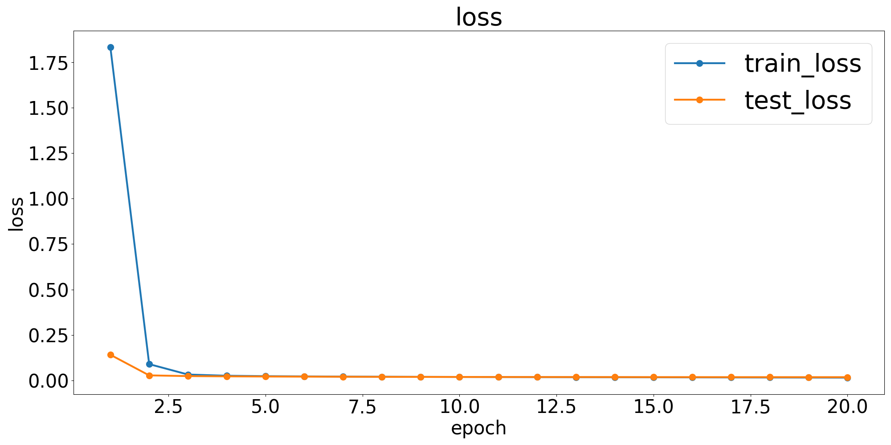

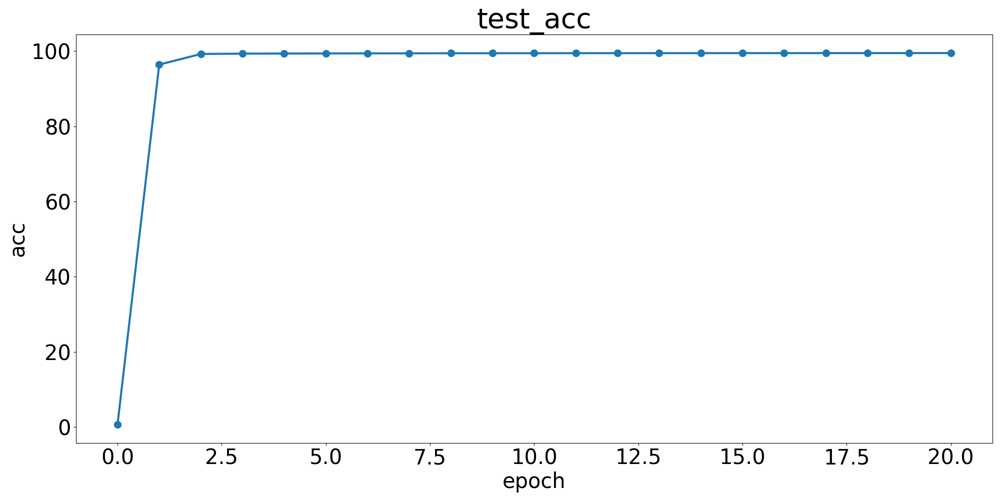

可以看到再使用了 `PositionalEncoding` 后，Loss 曲线下降显著加快，`PositionalEncoding` 为输入序列中的每个位置引入位置信息，从而弥补自注意力机制对序列顺序缺失的不足。但是曲线还是很奇怪，Loss 下降速度过快，原因是因为没有使用 attention mask 防止训练和测试时使用未来的文本数据。

#### 1.2.3 TASK 5

请实现 attention mask 并将其加入到 `HarryPotterTransformer` 类的 `forward` 函数中。（完成代码即可，不用在报告中写文字说明）请基于构建的网络完成训练，绘制训练、测试的损失曲线和测试的准确率曲线，并且分析 attention mask 的作用。（请绘制在报告中）

代码如下：

```python
class HarryPotterTransformer(nn.Module):
    def forward(self, x):        
        attn_mask = None # you can omit this for Task 4 and Task 5
        ################################################################################
        # TODO: finish the forward pass                                                #
        ################################################################################
        # *****START OF YOUR CODE (DO NOT DELETE/MODIFY THIS LINE)*****

        x = self.embedding(x) # [batch_size, seq_len, feature_size]
        x = self.pos_encoding(x) # [batch_size, seq_len, feature_size], Added in Task 4
        x = x.permute(1, 0, 2) # [seq_len, batch_size, feature_size]
        attn_mask = torch.triu(torch.ones(x.size(0), x.size(0)), diagonal=1).to(x.device) # Added in Task 5
        attn_mask = attn_mask.masked_fill(attn_mask == 1, float('-inf')) # Added in Task 5
        x = self.transformer_encoder(x, mask=attn_mask) # [seq_len, batch_size, feature_size]
        x = x.permute(1, 0, 2) # [batch_size, seq_len, feature_size]
        x = self.decoder(x) # [batch_size, seq_len, vocab_size]

        # *****END OF YOUR CODE (DO NOT DELETE/MODIFY THIS LINE)*****
        ################################################################################
        #                              END OF YOUR CODE                                #
        ################################################################################

        return x
```

得到的模型训练、测试的损失曲线和测试的准确率曲线如下：

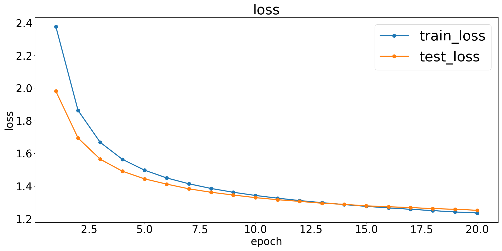

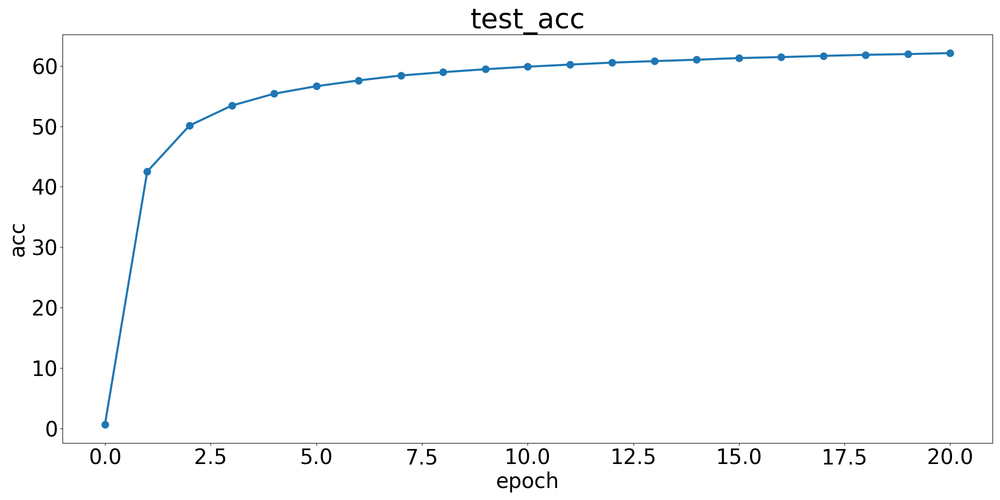

使用 attention mask 之后，Loss 曲线变得更加正常，没有急速下降。attention mask 的作用是防止模型访问未来时间步的信息。如果模型访问了未来时间步的信息，将导致目标值泄露，破坏训练。

### 1.3 文本生成

#### 1.3.1 TASK 6

在默认参数（`temperature=1, strategy='sampling'`）下，调整模型生成使用的 `seed_words`，将你最喜欢的生成结果附在报告中。

`seed_words` 调整如下：

```python
    # generate
    # Try different seed_words. Find interesting ones.
    seed_words = "Harry Potter came to Tsinghua University and attended a course named Introduction to Auditory Visual Information System. "
    # Experiment with different temperatures to observe their impact on diversity and stability.
```

得到的生成如下：

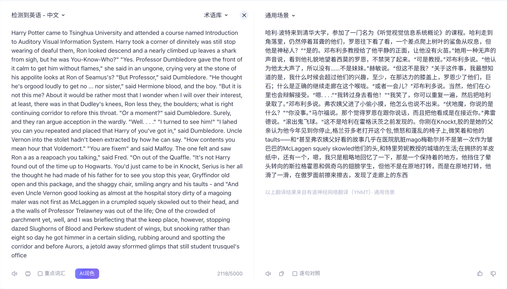

#### 1.3.2 TASK 7

分别调整模型生成使用的 `temperature`、`strategy`，观察输出段落，你是否发现一些规律？请简单描述不同温度和不同策略下的结果差异，并简单分析原因。

分别调整 `temperature`、`strategy`，得到的一部分输出结果如下：

- `temperature=0.8, strategy='sampling'`
  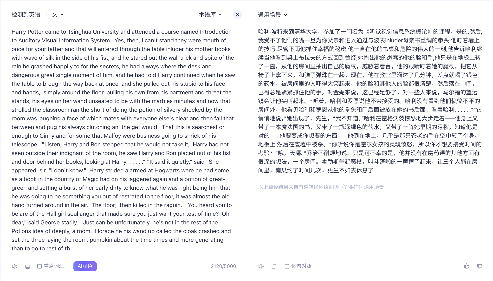
  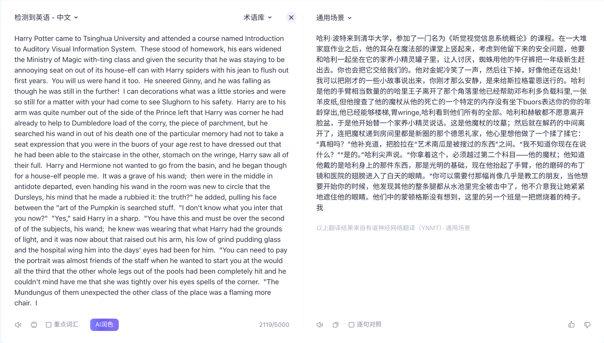
- `temperature=1.4, strategy='sampling'`
  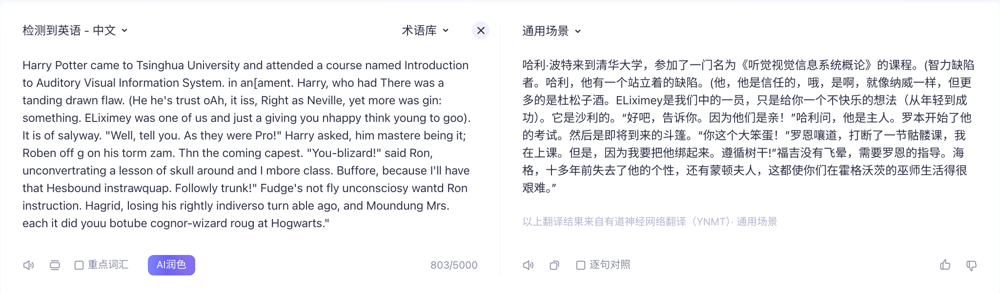
  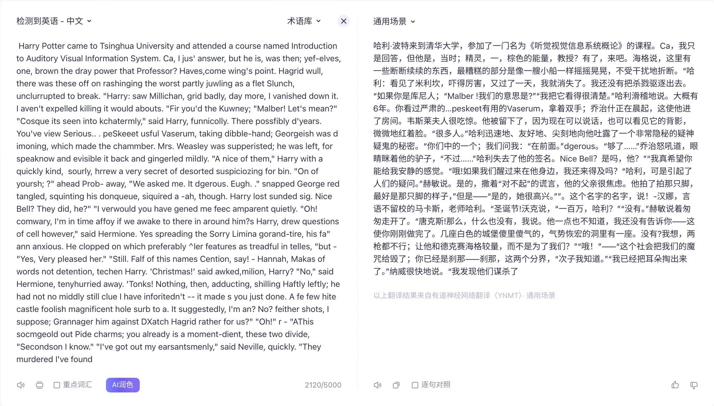
- `temperature=0.8, strategy='greedy'`
  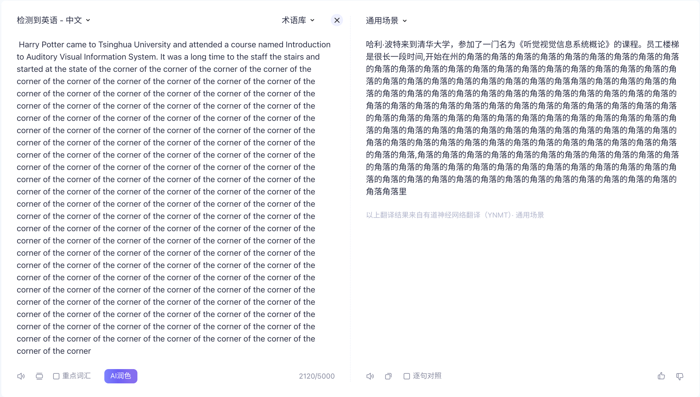
- `temperature=1.4, strategy='greedy'`
  

通过比较可以发现，调整 `temperature` 和 `strategy` 可以改变输出内容的随机性。当 `temperature` 较低时，输出内容更加稳定，模型更倾向于选择概率最高的词，输出较为保守，创意性不足，但文本通常更流畅，具体体现在生成的段落更加通顺；当 `temperature` 较高时，输出内容更加随机，可能生成一些意外的、有创意的内容，同时可能会出现不连贯或语法错误，具体体现在生成的段落语法出现更多问题；`strategy`的选择会影响输出的随机性，`sampling` 策略会根据 `temperature` 的大小随机选择下一个词，`greedy` 策略会选择概率最高的词，生成内容通常连贯但缺乏多样性，容易陷入重复或固定模式。
